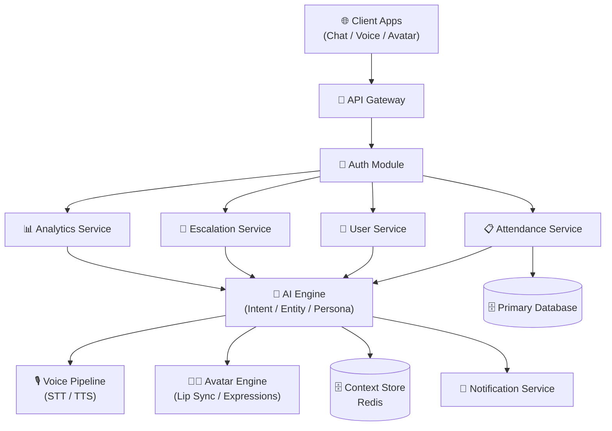

<div align="center">

</div>

<div align="center">


</div>

<h3 align="center">🚀 A human-like AI alternative to fragmented school communication portals like ClassDojo, Remind, and ParentSquare</h3>

<p align="center">
Built for <strong>students, parents, teachers, and school leadership</strong>, XYZ AI unifies chat, voice, and an animated AI avatar into a single assistant that understands intent, remembers context, and speaks 12 languages — replacing brittle, siloed school portals with one conversational layer that actually feels human.
</p>

<div align="center">

<a href="#-quick-start"></a>
<a href="#-api-reference"></a>
<a href="#-features"></a>

</div>

---

## 📑 Table of Contents

- [Purpose & Philosophy](#-purpose--philosophy)
- [Architecture](#-architecture)
- [Features](#-features)
- [Tech Stack](#-tech-stack)
- [Quick Start](#-quick-start)
- [Environment Configuration](#-environment-configuration)
- [API Reference](#-api-reference)
- [Use Cases](#-use-cases)
- [Project Structure](#-project-structure)
- [Docker Deployment](#-docker-deployment)
- [Testing](#-testing)
- [Troubleshooting](#-troubleshooting)
- [Roadmap](#-roadmap)
- [Contributing](#-contributing)
- [Contributors](#-contributors)
- [Star History](#-star-history)

---

## 💡 Purpose & Philosophy

> School communication today is fragmented across separate portals, has no unified voice interface, and forces every stakeholder — student, parent, teacher, principal — into the same rigid, robotic experience regardless of their role or language.

**XYZ AI** solves this with a single conversational system that adapts its persona, permissions, and language to whoever it's talking to, across text, voice, and an animated avatar.

- 🔐 **Security first** — zero-trust middleware validates token, role, permission, and resource-level context on every request, with prompt-injection sanitization on all inputs
- 🧩 **Modular architecture** — backend, AI engine, frontend, and mock APIs are independently deployable services connected through a clean API boundary
- 📊 **Context-aware by design** — a Redis-backed context manager scores message importance so conversations stay coherent without unbounded memory growth
- ⚡ **Built for scale** — Kubernetes-native with horizontal pod autoscaling and sub-200ms response targets under 1,000+ concurrent users

---

## 🏗️ Architecture



---

## ✨ Features

| Module | Capability | Auth Required | Role |
|:---|:---|:---:|:---|
| 🧠 **Intent Detection** | Classifies natural-language queries with 95%+ accuracy across 12 languages | ✅ | All |
| 🗣️ **Voice Interface** | Multilingual speech-to-text and text-to-speech via Wav2Vec2 and neural TTS voices | ✅ | All |
| 🎭 **AI Avatar** | Animated avatar with lip sync and facial expressions driven by response content | ✅ | All |
| 🧑‍🤝‍🧑 **Role-Based Personas** | Distinct conversational persona per role (student, parent, teacher, principal) | ✅ | All |
| 📋 **Attendance Management** | View and mark attendance with resource-level access control | ✅ | Student / Parent / Teacher |
| 📣 **Escalation Requests** | Structured escalation flow from student/parent queries to staff | ✅ | Student / Parent |
| 📊 **Analytics Dashboard** | Usage and conversation analytics for school leadership | ✅ | Teacher / Principal |
| 🧠 **Context Retention** | Redis-backed conversation memory with importance-weighted retention | ❌ | All |

---

## 🧰 Tech Stack

| Layer | Technology |
|:---|:---|
| **Backend Runtime** | Node.js 18+ / Express.js |
| **AI Engine Runtime** | Python 3.9+ / FastAPI |
| **AI/ML** | PyTorch, Transformers (Wav2Vec2), gTTS |
| **Frontend** | React + TypeScript |
| **Context Store** | Redis |
| **Database** | Primary DB (schema not present in repo — verify) <!-- VERIFY database engine --> |
| **Authentication** | JWT |
| **Containerization** | Docker, Docker Compose |
| **Orchestration** | Kubernetes (with HPA) |
| **Infrastructure as Code** | Terraform |
| **Monitoring** | Prometheus, Grafana, ELK Stack |
| **API Docs** | OpenAPI (`docs/api/openapi.yaml`) |

---

## 🚀 Quick Start

### Prerequisites

- Node.js `18+`
- Python `3.9+`
- Docker & Docker Compose
- Redis (or use the bundled container)

### Step 1 — Clone

```bash
git clone https://github.com/Shadhai/xyz-ai.git
cd xyz-ai
```

### Step 2 — Configure

```bash
cp .env.example .env
# then edit .env with your database, Redis, and model-path values
```

### Step 3 — Run

```bash
docker-compose -f infrastructure/docker/docker-compose.yml up --build
```

✅ **Success** — once running, services should be available at:
```
Backend API   → http://localhost:3000
AI Engine     → http://localhost:8000
Frontend      → http://localhost:5173
```

---

## ⚙️ Environment Configuration

```env
# ── Server ──────────────────────────────────────────────
PORT=3000
NODE_ENV=development

# ── Database ────────────────────────────────────────────
DB_HOST=localhost
DB_USER=xyz_ai
DB_PASSWORD=

# ── Redis ───────────────────────────────────────────────
REDIS_URL=redis://localhost:6379

# ── Authentication ──────────────────────────────────────
JWT_SECRET=

# ── AI / Voice Services ─────────────────────────────────
MODEL_PATH=./ai-engine/src/models/fine_tuned_models/education_model.bin
DEFAULT_LANGUAGE=en
```

<!-- ADD your actual credentials; do not commit .env -->

---

## 📖 API Reference

**Auth**

| Method | Endpoint | Description | Auth |
|:---:|:---|:---|:---:|
| `POST` | `/api/v1/auth/login` | Authenticate and receive JWT | ❌ |
| `POST` | `/api/v1/auth/refresh` | Refresh an access token | ✅ |

**Attendance**

| Method | Endpoint | Description | Role |
|:---:|:---|:---|:---|
| `GET` | `/api/v1/attendance/student/:id` | Get a student's attendance record | Student / Parent / Teacher |
| `POST` | `/api/v1/attendance/mark` | Mark attendance for a class | Teacher |

**Escalation**

| Method | Endpoint | Description | Role |
|:---:|:---|:---|:---|
| `POST` | `/api/v1/escalation` | Submit an escalation request | Student / Parent |
| `GET` | `/api/v1/escalation/:id` | View escalation status | Student / Parent / Teacher |

**Analytics**

| Method | Endpoint | Description | Role |
|:---:|:---|:---|:---|
| `GET` | `/api/v1/analytics/usage` | Conversation and usage analytics | Teacher / Principal |

<!-- UPDATE endpoints against docs/api/openapi.yaml for exact paths and payloads -->

📚 Full schema: see `docs/api/openapi.yaml` for the live Swagger definition.

---

## 🎯 Use Cases

### 🏫 Small School Deployment
A single-campus school runs XYZ AI as its primary parent-communication channel, replacing SMS blasts and a static portal with a chat and voice assistant that answers attendance questions in each family's preferred language.

### 🏢 Multi-Campus School District
A district deploys XYZ AI across multiple schools behind Kubernetes with horizontal autoscaling, routing role-based permissions so principals see district-wide analytics while teachers only see their own classes.

### 🎓 Academic / Portfolio Project
A student or researcher uses XYZ AI's persona and context-management architecture as a reference implementation for applied conversational AI with role-based access control.

### ♿ Accessibility-First Integration
A school with a large multilingual or low-literacy parent population relies on the voice and avatar interfaces to make attendance and escalation flows accessible without requiring text literacy.

---

## 📁 Project Structure

```
xyz-ai/
├── 📁 backend/                # Node.js/Express API
│   └── src/
│       ├── api/v1/            # routes, controllers, middleware, validators
│       ├── core/               # config, constants, errors, utils
│       ├── models/             # User, Student, Parent, Teacher, Attendance...
│       └── services/           # attendance, user, escalation, analytics
│
├── 📁 ai-engine/               # Python/FastAPI AI core
│   └── src/
│       ├── nlp/                 # intent, entity, language, context
│       ├── persona/              # role-based conversational personas
│       ├── voice/                 # STT/TTS pipeline
│       ├── avatar/                 # lip sync + expressions
│       └── models/                  # fine-tuned model artifacts
│
├── 📁 frontend/                # React + TypeScript client
│   └── src/
│       ├── components/          # Chat, Voice, Avatar, Common
│       ├── pages/                 # Login, Dashboard, ChatPage, Analytics
│       └── services/               # api, websocket, auth, voice
│
├── 📁 mock-apis/               # attendance/user/escalation mocks
├── 📁 infrastructure/          # Docker, Kubernetes, Terraform
├── 📁 monitoring/              # Prometheus, Grafana, ELK
└── 📁 docs/                    # API, architecture, security, guides
```

---

## 🐳 Docker Deployment

```bash
docker-compose -f infrastructure/docker/docker-compose.yml up --build
```

For production:
```bash
docker-compose -f infrastructure/docker/docker-compose.prod.yml up -d
```

Kubernetes manifests (deployments, services, ingress, HPA) live under `infrastructure/kubernetes/`.

---

## 🧪 Testing

```bash
# Backend (Node.js)
cd backend && npm test

# AI Engine (Python)
cd ai-engine && pytest
```

<!-- UPDATE test runner if backend uses a different framework than Mocha/Chai -->

---

## 🩺 Troubleshooting

| Symptom | Likely Cause | Fix |
|:---|:---|:---|
| `Cannot connect to database` | Wrong credentials or DB not running | Check `DB_HOST`, `DB_USER`, `DB_PASSWORD` in `.env` |
| `Redis connection refused` | Redis container not started | Confirm `REDIS_URL` and that the Redis service is up |
| `401 Unauthorized` on every request | Missing or expired JWT | Re-authenticate via `/api/v1/auth/login`, check `JWT_SECRET` matches |
| `Port already in use` | Another process bound to 3000/8000 | Change `PORT` in `.env` or stop the conflicting process |
| `Model file not found` | `MODEL_PATH` points to a missing `.bin` file | Verify `ai-engine/src/models/fine_tuned_models/` contains the model |
| `CORS error` in browser console | Frontend origin not whitelisted | Add frontend URL to backend CORS config |

---

## 🗺️ Roadmap

- [x] Role-based persona engine (student/parent/teacher/principal)
- [x] Multilingual voice pipeline (STT/TTS)
- [x] AI avatar with lip sync and expressions
- [x] Zero-trust auth middleware with prompt-injection sanitization
- [x] Kubernetes autoscaling configuration
- [ ] 🚧 Native mobile app (iOS/Android)
- [ ] 🚧 Expanded language coverage beyond current 12
- [ ] 🚧 Real-time analytics streaming dashboard
- [ ] 🚧 SIS (Student Information System) integrations beyond mock APIs

---

## 🤝 Contributing

```bash
# 1. Fork the repository
# 2. Clone your fork
git clone https://github.com/YOUR_USERNAME/xyz-ai.git

# 3. Create a feature branch
git checkout -b feature/your-feature-name

# 4. Make your changes and commit
git commit -m "Add: your feature description"

# 5. Push to your fork
git push origin feature/your-feature-name

# 6. Open a Pull Request against main
```

See `docs/development/contributing.md` for code style and review guidelines.

---

## 👥 Contributors

<div align="center">
<a href="https://github.com/Shadhai/xyz-ai/graphs/contributors">

</a>
</div>

---

## ⭐ Star History

<div align="center">

[](https://star-history.com/#Shadhai/xyz-ai&Date)

</div>

---

## 🤖 AI-Ready

This repository includes stub files for AI coding agents:
- `llms.txt` — machine-readable project summary
- `AGENTS.md` — instructions for AI coding assistants working in this repo

<!-- Generate these stub files separately if not already present in the repo -->

<div align="center">

</div>
